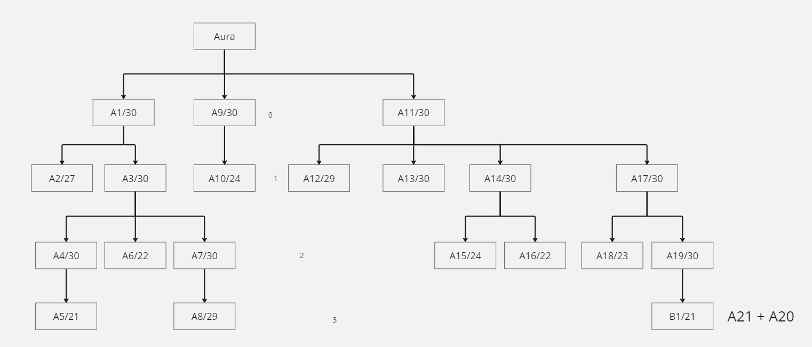
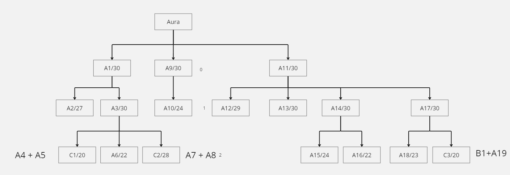
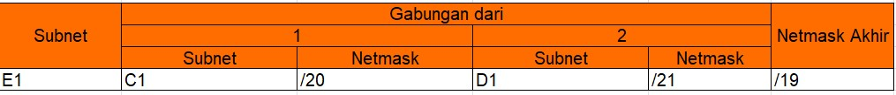
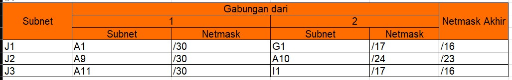

# Jarkom-Modul-4-B01-2023

| Name           | NRP        | Kelas     |
| ---            | ---        | ----------|
| Rr. Diajeng Alfisyahrinnisa Anandha | 5025211147 | Jaringan Komputer (B) |

<br></br>

# A. VLSM

## Gambar Topologi

<br></br>

## Rute

<br></br>

### Dari rute tersebut, kita ketahui bahwa netmask paling rendah adalah /19


## Tree VLSM

<br></br>

## Pembagian IP berdasarkan tree VLSM

<br></br>

## Setup network konfig di GNS:

### 1. Aura:

```
auto eth0
iface eth0 inet dhcp
up iptables -t nat -A POSTROUTING -o eth0 -j MASQUERADE -s 10.9.0.0/19

auto eth1
iface eth1 inet static
	address 10.9.0.1
	netmask 255.255.255.252

auto eth2
iface eth2 inet static
	address 10.9.0.17
	netmask 255.255.255.252


auto eth3
iface eth3 inet static
	address 10.9.0.21
	netmask 255.255.255.252

```

### 2. Frieren:

```
auto eth0
iface eth0 inet static
	address 10.9.0.2
	netmask 255.255.255.252
	gateway 10.9.0.1
	up echo nameserver 192.168.122.1 > /etc/resolv.conf

auto eth1
iface eth1 inet static
	address 10.9.0.5
	netmask 255.255.255.252

auto eth2
iface eth2 inet static
	address 10.9.0.65
	netmask 255.255.255.224
```

### 3. LakeKorridor:

```
auto eth0
iface eth0 inet static
	address 10.9.0.66
	netmask 255.255.255.224
	gateway 10.9.0.65
	up echo nameserver 192.168.122.1 > /etc/resolv.conf
```

### 4. Flamme:

```
auto eth0
iface eth0 inet static
	address 10.9.0.6
	netmask 255.255.255.252
	gateway 10.9.0.5
	up echo nameserver 192.168.122.1 > /etc/resolv.conf

auto eth1
iface eth1 inet static
	address 10.9.0.9
	netmask 255.255.255.252

auto eth2
iface eth2 inet static
	address 10.9.8.1
	netmask 255.255.252.0

auto eth3
iface eth3 inet static
	address 10.9.0.13
	netmask 255.255.255.252
```

### 5. Fern:

```
auto eth0
iface eth0 inet static
	address 10.9.0.10
	netmask 255.255.255.252
	gateway 10.9.0.9
	up echo nameserver 192.168.122.1 > /etc/resolv.conf

auto eth1
iface eth1 inet static
	address 10.9.24.1
	netmask 255.255.248.0
```

### 6. LaubHills:

```
auto eth0
iface eth0 inet static
	address 10.9.24.2
	netmask 255.255.248.0
	gateway 10.9.24.1
	up echo nameserver 192.168.122.1 > /etc/resolv.conf
```

### 7. AppetitRegion:

```
auto eth0
iface eth0 inet static
	address 10.9.24.3
	netmask 255.255.248.0
	gateway 10.9.24.1
	up echo nameserver 192.168.122.1 > /etc/resolv.conf
```

### 8. RohrRoad:

```
auto eth0
iface eth0 inet static
	address 10.9.8.2
	netmask 255.255.252.0
	gateway 10.9.8.1
	up echo nameserver 192.168.122.1 > /etc/resolv.conf
```

### 9. Himmel:

```
auto eth0
iface eth0 inet static
	address 10.9.0.14
	netmask 255.255.255.252
	gateway 10.9.0.13
	up echo nameserver 192.168.122.1 > /etc/resolv.conf

auto eth1
iface eth1 inet static
	address 10.9.0.41
	netmask 255.255.255.248
```

### 10. SchwerMountains:

```
auto eth0
iface eth0 inet static
	address 10.9.0.42
	netmask 255.255.255.248
	gateway 10.9.0.41
	up echo nameserver 192.168.122.1 > /etc/resolv.conf
```

### 11. Denken:

```
auto eth0
iface eth0 inet static
	address 10.9.0.18
	netmask 255.255.255.252
	gateway 10.9.0.17
	up echo nameserver 192.168.122.1 > /etc/resolv.conf

auto eth1
iface eth1 inet static
	address 10.9.1.1
	netmask 255.255.255.0
```

### 12. RoyalCapital:

```
auto eth0
iface eth0 inet static
	address 10.9.1.2
	netmask 255.255.255.0
	gateway 10.9.1.1
	up echo nameserver 192.168.122.1 > /etc/resolv.conf
```

### 13. WilleRegion:

```
auto eth0
iface eth0 inet static
	address 10.9.1.3
	netmask 255.255.255.0
	gateway 10.9.1.1
	up echo nameserver 192.168.122.1 > /etc/resolv.conf
```

### 14. Eisen:

```
auto eth0
iface eth0 inet static
	address 10.9.0.22
	netmask 255.255.255.252
	gateway 10.9.0.21
	up echo nameserver 192.168.122.1 > /etc/resolv.conf

auto eth1
iface eth1 inet static
	address 10.9.0.49
	netmask 255.255.255.248

auto eth2
iface eth2 inet static
	address 10.9.0.33
	netmask 255.255.255.252

auto eth3
iface eth3 inet static
	address 10.9.0.29
	netmask 255.255.255.252

auto eth4
iface eth4 inet static
	address 10.9.0.25
	netmask 255.255.255.252
```

### 15. Stark:

```
auto eth0
iface eth0 inet static
	address 10.9.0.26
	netmask 255.255.255.252
	gateway 10.9.0.25
	up echo nameserver 192.168.122.1 > /etc/resolv.conf
```

### 16. Richter:

```
auto eth0
iface eth0 inet static
	address 10.9.0.50
	netmask 255.255.255.248
	gateway 10.9.0.49
	up echo nameserver 192.168.122.1 > /etc/resolv.conf
```

### 17. Revolte:

```
auto eth0
iface eth0 inet static
	address 10.9.0.51
	netmask 255.255.255.248
	gateway 10.9.0.49
	up echo nameserver 192.168.122.1 > /etc/resolv.conf
```

### 18. Lugner:

```
auto eth0
iface eth0 inet static
	address 10.9.0.30
	netmask 255.255.255.252
	gateway 10.9.0.29
	up echo nameserver 192.168.122.1 > /etc/resolv.conf

auto eth1
iface eth1 inet static
	address 10.9.2.1
	netmask 255.255.255.0

auto eth2
iface eth2 inet static
	address 10.9.12.1
	netmask 255.255.252.0
```

### 19. TurkRegion:

```
auto eth0
iface eth0 inet static
	address 10.9.12.2
	netmask 255.255.252.0
	gateway 10.9.12.1
	up echo nameserver 192.168.122.1 > /etc/resolv.conf
```

### 20. GrobeForest:

```
auto eth0
iface eth0 inet static
	address 10.9.12.3
	netmask 255.255.252.0
	gateway 10.9.12.1
	up echo nameserver 192.168.122.1 > /etc/resolv.conf
```

### 21. Linie:

```
auto eth0
iface eth0 inet static
	address 10.9.0.34
	netmask 255.255.255.252
	gateway 10.9.0.33
	up echo nameserver 192.168.122.1 > /etc/resolv.conf

auto eth1
iface eth1 inet static
	address 10.9.0.37
	netmask 255.255.255.252

auto eth2
iface eth2 inet static
	address 10.9.4.1
	netmask 255.255.254.0
```

### 22. GranzChannel:

```
auto eth0
iface eth0 inet static
	address 10.9.4.2
	netmask 255.255.254.0
	gateway 10.9.4.1
	up echo nameserver 192.168.122.1 > /etc/resolv.conf
```

### 23. Lawine:

```
auto eth0
iface eth0 inet static
	address 10.9.0.38
	netmask 255.255.255.252
	gateway 10.9.0.37
	up echo nameserver 192.168.122.1 > /etc/resolv.conf

auto eth1
iface eth1 inet static
	address 10.9.0.129
	netmask 255.255.255.192
```

### 24. Heiter:

```
auto eth0
iface eth0 inet static
	address 10.9.0.130
	netmask 255.255.255.192
	gateway 10.9.0.129
	up echo nameserver 192.168.122.1 > /etc/resolv.conf

auto eth1
iface eth1 inet static
	address 10.9.16.1
	netmask 255.255.252.0
```

### 25. BredtRegion:

```
auto eth0
iface eth0 inet static
	address 10.9.0.131
	netmask 255.255.255.192
	gateway 10.9.0.129
	up echo nameserver 192.168.122.1 > /etc/resolv.conf
```

### 26. Sein:

```
auto eth0
iface eth0 inet static
	address 10.9.16.2
	netmask 255.255.252.0
	gateway 10.9.16.1
	up echo nameserver 192.168.122.1 > /etc/resolv.conf
```

### 27. RiegelCanyon:

```
auto eth0
iface eth0 inet static
	address 10.9.16.3
	netmask 255.255.252.0
	gateway 10.9.16.1
	up echo nameserver 192.168.122.1 > /etc/resolv.conf
```

## Routing VLSM di GNS:

### 1. Aura:

```
route add -net 10.9.0.64 netmask 255.255.255.224 gw 10.9.0.2

route add -net 10.9.0.4 netmask 255.255.255.252 gw 10.9.0.2

route add -net 10.9.0.8 netmask 255.255.255.252 gw 10.9.0.2

route add -net 10.9.24.0 netmask 255.255.248.0 gw 10.9.0.2

route add -net 10.9.8.0 netmask 255.255.252.0 gw 10.9.0.2

route add -net 10.9.0.12 netmask 255.255.255.252 gw 10.9.0.2

route add -net 10.9.0.40 netmask 255.255.255.248 gw 10.9.0.2

route add -net 10.9.1.0 netmask 255.255.255.0 gw 10.9.0.18

route add -net 10.9.0.24 netmask 255.255.255.252 gw 10.9.0.22

route add -net 10.9.0.48 netmask 255.255.255.248 gw 10.9.0.22

route add -net 10.9.0.28 netmask 255.255.255.252 gw 10.9.0.22

route add -net 10.9.2.0 netmask 255.255.255.0 gw 10.9.0.22

route add -net 10.9.12.0 netmask 255.255.252.0 gw 10.9.0.22

route add -net 10.9.0.32 netmask 255.255.255.252 gw 10.9.0.22

route add -net 10.9.4.0 netmask 255.255.254.0 gw 10.9.0.22

route add -net 10.9.0.36 netmask 255.255.255.252 gw 10.9.0.22

route add -net 10.9.0.128 netmask 255.255.255.192 gw 10.9.0.22

route add -net 10.9.16.0 netmask 255.255.252.0 gw 10.9.0.22
```

### 2. Frieren:

```
route add -net 10.9.0.8 netmask 255.255.255.252 gw 10.9.0.6

route add -net 10.9.24.0 netmask 255.255.248.0 gw 10.9.0.6

route add -net 10.9.8.0 netmask 255.255.252.0 gw 10.9.0.6

route add -net 10.9.0.12 netmask 255.255.255.252 gw 10.9.0.6

route add -net 10.9.0.40 netmask 255.255.255.248 gw 10.9.0.6
```

### 3. Flamme:

```
route add -net 10.9.24.0 netmask 255.255.248.0 gw 10.9.0.10

route add -net 10.9.0.40 netmask 255.255.255.248 gw 10.9.0.14
```

### 4. Eisen:

```
route add -net 10.9.2.0 netmask 255.255.255.0 gw 10.9.0.30

route add -net 10.9.12.0 netmask 255.255.252.0 gw 10.9.0.30

route add -net 10.9.4.0 netmask 255.255.254.0 gw 10.9.0.34

route add -net 10.9.0.36 netmask 255.255.255.252 gw 10.9.0.34

route add -net 10.9.0.128 netmask 255.255.255.192 gw 10.9.0.34

route add -net 10.9.16.0 netmask 255.255.252.0 gw 10.9.0.34
```

### 5. Linie:

```
route add -net 10.9.0.128 netmask 255.255.255.192 gw 10.9.0.38

route add -net 10.9.16.0 netmask 255.255.252.0 gw 10.9.0.38
```

### 6. Lawine:

```
route add -net 10.9.16.0 netmask 255.255.252.0 gw 10.9.0.130
```

# B. CIDR

## Gambar Topologi

<br></br>

## Rute

<br></br>

## Penggabungan IP untuk menemukan netmask tertinggi:

### Rute 0:

<br></br>

### Rute 1:

<br></br>

<br></br>

### Rute 2:

<br></br>

<br></br>

### Rute 3:

<br></br>

<br></br>

### Rute 4:

<br></br>

<br></br>

### Rute 5:

<br></br>

<br></br>

### Rute 6:

<br></br>

<br></br>

### Rute 7:

<br></br>

<br></br>

### Rute 8:

<br></br>

<br></br>

### Rute 9:

<br></br>

<br></br>


### Rute 10:

<br></br>

<br></br>

### Rute 11:

<br></br>

<br></br>

#### Dari rute tersebut, kita ketahui bahwa netmask paling rendah adalah /14

## Tree CIDR

<br></br>

## Pembagian IP berdasarkan tree CIDR

<br></br>

## Setup network konfig di CPT:

### 1. Aura:

```
0/1: 10.9.128.1

255.255.255.252

1/0: 10.9.1.1
255.255.255.252

1/1: 10.8.128.1
255.255.255.252
```

### 2. Frieren:

```
0/0: 10.9.128.2
255.255.255.252

0/1: 10.9.66.1
255.255.255.224

1/0: 10.9.34.1
255.255.255.252
```

### 3. Flamme:

```
0/0: 10.9.34.2
255.255.255.252

0/1: 10.9.22.9
255.255.255.252

1/0: 10.9.10.1
255.255.255.252

1/1: 10.9.18.1
255.255.252.0
```

### 4. Fern:

```
0/0: 10.9.10.2
255.255.255.252

0/1: 10.9.2.1
255.255.248.0
```

### 5. Himmel:

```
0/0: 10.9.22.10
255.255.255.252

0/1: 10.9.22.1
255.255.255.248
```

### 6. Denken:

```
0/0: 10.9.1.2
255.255.255.252

0/1: 10.9.0.1
255.255.255.0
```

### 7. Eisen:

```
0/0: 10.8.128.2
255.255.255.252

0/1: 10.8.80.9
255.255.255.252

1/0: 10.8.80.1
255.255.255.248

1/1: 10.8.72.1
255.255.255.252

1/2: 10.8.32.1
255.255.255.252
```

### 8. Lugner:

```
0/0: 10.8.72.2
255.255.255.252

0/1: 10.8.65.1
255.255.252.0

1/0: 10.8.64.1
255.255.255.0
```

### 9. Linie:

```
0/0: 10.8.32.2
255.255.255.252

0/1: 10.8.16.1
255.255.254.0

1/0: 10.8.8.1
255.255.255.252
```

### 10. Lawine:

```
0/0: 10.8.8.2
255.255.255.252

0/1: 10.8.4.1
255.255.255.192
```

### 11. Heiter:

```
0/0: 10.8.4.2
255.255.255.192

0/1: 10.8.0.1
255.255.252.0
```

### 12. LakeKorridor:

```
10.9.66.2
gw: 10.9.66.1
255.255.255.224
```

### 13. LaubHills:

```
10.9.2.2
gw: 10.9.2.1
255.255.248.0
```

### 14. AppetitRegion:

```
10.9.2.3
0/1: 10.9.2.1
255.255.248.0
```

### 15. RohrRoad:

```
10.9.18.2
1/1: 10.9.18.1
255.255.252.0
```

### 16. SchwerMountains:

```
10.9.22.2
0/1: 10.9.22.1
255.255.255.248
```

### 17. RoyalCapital:

```
10.9.0.2
0/1: 10.9.0.1
255.255.255.0
```

### 18. WilleRegion:

```
10.9.0.3
0/1: 10.9.0.1
255.255.255.0
```

### 19. Stark:

```
10.8.80.10
0/1: 10.8.80.9
255.255.255.252
```

### 20. Richter:

```
10.8.80.2
1/0: 10.8.80.1
255.255.255.248
```

### 21. Revolte:

```
10.8.80.3
1/0: 10.8.80.1
255.255.255.248
```

### 22. TurkRegion:

```
10.8.65.2
0/1: 10.8.65.1
255.255.252.0
```

### 23. GrobeForest:

```
10.8.64.2
1/0: 10.8.64.1
255.255.255.0
```

### 24. GranzChannel:

```
10.8.16.2
0/1: 10.8.16.1
255.255.254.0
```

### 25. BradtRegion:

```
10.8.4.3
0/1: 10.8.4.1
255.255.255.192
```

### 26. Sein:

```
10.8.0.2
0/1: 10.8.0.1
255.255.252.0
```

### 27. RiegelCanyon:

```
10.8.0.3
0/1: 10.8.0.1
255.255.252.0
```

## Routing CIDR di CPT:

### 1. Aura:

```
network: 10.9.0.0
mask: 255.255.255.0
next hop: 10.9.1.2


network: 10.9.66.0
mask: 255.255.255.224
next hop: 10.9.128.2

network: 10.9.34.0
mask: 255.255.255.252
next hop: 10.9.128.2

network: 10.9.10.0
mask: 255.255.255.252
next hop: 10.9.128.2

network: 10.9.2.0
mask: 255.255.248.0
next hop: 10.9.128.2

network: 10.9.18.0
mask: 255.255.252.0
next hop: 10.9.128.2

network: 10.9.22.8
mask: 255.255.255.252
next hop: 10.9.128.2

network: 10.9.22.0
mask: 255.255.255.248
next hop: 10.9.128.2

network: 10.8.80.8
mask: 255.255.255.252
next hop: 10.8.128.2

network: 10.8.80.0
mask: 255.255.255.248
next hop: 10.8.128.2

network: 10.8.72.0
mask: 255.255.255.252
next hop: 10.8.128.2

network: 10.8.65.0
mask: 255.255.252.0
next hop: 10.8.128.2

network: 10.8.64.0
mask: 255.255.252.0
next hop: 10.8.128.2

network: 10.8.32.0
mask: 255.255.255.252
next hop: 10.8.128.2

network: 10.8.16.0
mask: 255.255.254.0
next hop: 10.8.128.2

network: 10.8.8.0
mask: 255.255.255.252
next hop: 10.8.128.2

network: 10.8.4.0
mask: 255.255.255.192
next hop: 10.8.128.2

network: 10.8.0.0
mask: 255.255.252.0
next hop: 10.8.128.2

```

### 2. Frieren:

```
network: 10.9.10.0
mask: 255.255.255.252
next hop: 10.9.34.2

network: 10.9.2.0
mask: 255.255.248.0
next hop: 10.9.34.2

network: 10.9.18.0
mask: 255.255.252.0
next hop: 10.9.34.2

network: 10.9.22.8
mask: 255.255.255.252
next hop: 10.9.34.2

network: 10.9.22.0
mask: 255.255.255.248
next hop: 10.9.34.2

network: 0.0.0.0
mask: 0.0.0.0
next hop: 10.9.128.1
```

### 3. Flamme:

```
network: 10.9.2.0
mask: 255.255.248.0
next hop: 10.9.10.2

network: 10.9.22.0
mask: 255.255.248.0
next hop: 10.9.22.10

network: 0.0.0.0
mask: 0.0.0.0
next hop: 10.9.34.1
```

### 4. Fern:

```
network: 0.0.0.0
mask: 0.0.0.0
next hop: 10.9.10.1
```

### 5. Himmel:

```
network: 0.0.0.0
mask: 0.0.0.0
next hop: 10.9.22.9
```

### 6. Denken:

```
network: 0.0.0.0
mask: 0.0.0.0
next hop: 10.9.1.1
```

### 7. Eisen:

```
network: 0.0.0.0
mask: 0.0.0.0
next hop: 10.8.128.1

network: 10.8.65.0
mask: 255.255.252.0
next hop: 10.8.72.2

network: 10.8.64.0
mask: 255.255.255.0
next hop: 10.8.72.2

network: 10.8.16.0
mask: 255.255.254.0
next hop: 10.8.32.2

network: 10.8.8.0
mask: 255.255.255.252
next hop: 10.8.32.2

network: 10.8.4.0
mask: 255.255.255.192
next hop: 10.8.32.2

network: 10.8.0.0
mask: 255.255.252.0
next hop: 10.8.32.2
```

### 8. Lugner:

```
network: 0.0.0.0
mask: 0.0.0.0
next hop: 10.8.72.1
```

### 9. Linie:

```
network: 0.0.0.0
mask: 0.0.0.0
next hop: 10.8.32.1

network: 10.8.4.0
mask: 255.255.255.192
next hop: 10.8.8.2

network: 10.8.0.0
mask: 255.255.252.0
next hop: 10.8.8.2
```

### 10. Lawine:

```
network: 0.0.0.0
mask: 0.0.0.0
next hop: 10.8.8.1

network: 10.8.0.0
mask: 255.255.252.0
next hop: 10.8.4.2
```

### 11. Heiter:

```
network: 0.0.0.0
mask: 0.0.0.0
next hop: 10.8.4.1
```

# C. Kendala Pengerjaaan

Tidak ada inshaAllah